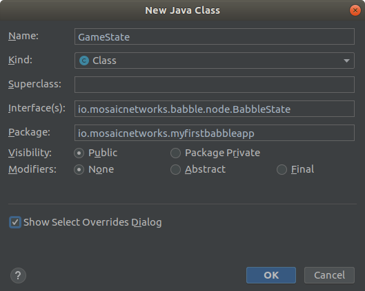

# Tutorial

This tutorial takes you step by step through building a minimal app using [the Babble Android library](https://github.com/mosaicnetworks/babble-android). Babble Android is an implementation of [Babble](https://github.com/mosaicnetworks/babble) for mobile Android Devices. It provides a mechanism for mobile devices to reach a consensus. 

The example we are working towards here is a random number generator, where all peers will agree on the correct order of the random numbers. It is intended as a minimal implementation that can be easily adapted for other projects. 

The source code for this tutorial is all available at [GitHub](https://github.com/jonknight73/MyFirstBabbleApp).


## Create a Hello World App

In Android Studio create a new project. Select Empty Activity.


Click ``Next``


Enter your app name. The package name and Save Location should be updated to reflect the name that you entered. Change the minimum API level to API 21 (Lollipop). Click ``Finish``.


You can run the app just to check that all the dependencies are correctly in place. 


Now we have a working project we need to pull in the Babble Android library -- which is the whole point of this article after all. 

## Add Babble to the App

Update the ``app/build.gradle`` file adding the line below to the dependencies section.

```gradle
implementation 'io.mosaicnetworks:babble:0.5.0'
```
You should get a banner saying the Gradle File has changed, click on the ``Sync Now`` link on the right hand side of the banner.

You should be able to run the app again, and it will be unchanged. 

There is a possibility that you will get a message like this:
```
No version of NDK matched the requested version 20.0.5594570. Versions available locally: 21.0.6113669
```

Babble Android requires an Android NDK framework be installed to build. If you have no NDK installed, just follow the link. If you already, as in this case, have a later version installed, then select the ``File > Project Structure`` menu item. 


Select the NDK that you have installed from the dropdown. And click ``OK``. The app should now run.

## Make Babble Visible

Our App will have 2 Activities. ``MainActivity`` allows the user to create a new Babble Group or to discover and join an existing Babble Group. The good news is that there is an implementation this in the Library, so it takes very little code. ``GameActivity`` will handle what happens when we are actually in the group and gossiping. 

Initially we are going to create a placeholder ``GameActivity``.  Using Android Studio create an Empty App -- filling in the options as below:


Click ``Finish``.

Now that we have an Activity, dull as it is, to launch we can build our ``MainActivity``. 

Open ``MainActivity.java``.

It will look something like this (with the imports collapsed):

```java
package io.mosaicnetworks.myfirstbabbleapp;

public class MainActivity extends AppCompatActivity {

    @Override
    protected void onCreate(Bundle savedInstanceState) {
        super.onCreate(savedInstanceState);
        setContentView(R.layout.activity_main);
    }
}
```

Amend to the class definition to amend the extends clause as below. The autocomplete will make suggestions. Select the ``io.mosaicnetworks.babble.configure`` entry. It will add an appropriate import statement. 

```java
public class MainActivity extends BaseConfigActivity {
```


Next we remove the line: 
```java
setContentView(R.layout.activity_main);
```

from the ``onCreate`` method. The layout is set in ``BaseConfigActivity``.  ``onCreate`` now looks like: 

```java
    @Override
    protected void onCreate(Bundle savedInstanceState) {
        super.onCreate(savedInstanceState);
    }
```    


The class definition will have a red wiggly line under it, as ``BaseConfigActivity`` is an abstract class, we need to add some method implementations. 

Add a few new lines before the closing class curly bracket and place the cursor in the middle of the newfound space. Right Click, select ``Generate`` from the menu. Then select ``Implement`` from the sub menu. 


All the ``BaseConfigActivity`` methods should be highlighted. Press ``OK``.

3 new methods will have been added to the source:

+ ``onJoined(String moniker, String group)``
+ ``onStartedNew(String moniker, String group)``
+ ``onArchiveLoaded(String moniker, String group)``

Each of these 3 methods do a very similar task. They each launch the ``GameActivity`` after generating the Babble configuration. ``onStartedNew`` creates a new Babble Group with this user as the sole peer. ``onJoined`` joins a group found via one of the service discovery mechanisms. ``onArchiveLoaded`` means that the user selected to replay an archived group -- which means the Babble node never starts gossiping -- it is read only. 


Amend those 3 methods to read as follows:
```java
    @Override
    public void onJoined(String moniker, String group) {
        Intent intent = new Intent(this, GameActivity.class);
        intent.putExtra("MONIKER", moniker);
        intent.putExtra("ARCHIVE_MODE", false);
        intent.putExtra("GROUP", group);
        startActivity(intent);
    }

    @Override
    public void onStartedNew(String moniker, String group) {
        Intent intent = new Intent(this, GameActivity.class);
        intent.putExtra("MONIKER", moniker);
        intent.putExtra("ARCHIVE_MODE", false);
        intent.putExtra("GROUP", group);
        startActivity(intent);
    }

    public void onArchiveLoaded(String moniker, String group) {
        Intent intent = new Intent(this, GameActivity.class);
        intent.putExtra("MONIKER", moniker);
        intent.putExtra("ARCHIVE_MODE", true);
        intent.putExtra("GROUP", group);
        startActivity(intent);
    }
```

Each of these methods passes a Moniker (your name / handle), a Group Name (simply to identify this session), and a boolean flag to denote whether this is in Archive mode or not, to an instance of ``GameActivity`` using an ``Intent``. 


The app will now run and let you explore the discovery / new group options, but will stall at the point you try to join / start a group. This is to be expected. We have not finished yet. 

##Matters of State
 
Babble provides a consensus mechanism allowing you to guarantee an ordered set of transactions amongst multiple nodes. Babble is agnostic about what those transactions are, and what state they update. But we need to implement a state to process the Blocks produced by Babble. 

Our state class is going to be called ``GameState``. It implements the ``BabbleState`` interface from the babble library. 



Use the New Class wizard to create ``GameState.java``. Make sure you
select the ``Show Select Overrides Dialog`` checkbox. Highlight all of the BabbleState methods and press ``OK``. 

Your GameState should now look like this:
```java
package io.mosaicnetworks.myfirstbabbleapp;

import io.mosaicnetworks.babble.node.BabbleState;
import io.mosaicnetworks.babble.node.Block;

public class GameState implements BabbleState {
    @Override
    public Block processBlock(Block block) {
        return null;
    }

    @Override
    public void reset() {

    }
}
```

To connect our state to the Babble Android Service, we need to add a line to ``MainActivity`` as follows:

```java
    @Override
    protected void onCreate(Bundle savedInstanceState) {
        BabbleService.setAppState(new GameState());
        super.onCreate(savedInstanceState);
    }
```

## Transactions

The State Machine can only be updated by Transactions that have passed through consensus, and are returned as blocks from Babble. Transactions for ``BabbleState`` must implement the ``BabbleTx`` interface. 

Lets create a ``GameTx`` class. Create a new Java Class. Specify a ``BabbleTx`` interface and click Final. Transactions should not be being changed ever.


Remember to check the *Show Select Overrides Dialog* checkbox. Click ``OK``. Highlight the ``toBytes`` method and click ``OK``.

We a generated class that looks like below:

```java
public final class GameTx implements BabbleTx {
    @Override
    public byte[] toBytes() {
        return new byte[0];
    }
}
```

``BabbleTx`` only requires one method -- ``toBytes`` which exports the transaction as a Byte Array -- which is the form Babble expects a transaction to be in. The Byte Array can hold any information that your app needs, as long as it can be serialised to a byte array. 

For this trivial example we could just embed the random number directly in the byte array. However, that is not great practice for anything other that a trivial example.

So instead we are going to use a JSON format for the transaction and use the GSON library to do all of the heavy lifting. 

First we add the library. In ``app/build.gradle`` add the following line to the dependencies section.

```gradle
implementation 'com.google.code.gson:gson:2.8.6'
```

Click ``Synch Now`` on the banner that appear on the code window.

Back in ``GameTx.java``, amend to as follows:

```java
public final class GameTx implements BabbleTx {

    private final static Gson gson = new GsonBuilder().create();

    @SerializedName("num")
    public final int num;
    
    public GameTx(int num) {
        this.num = num;
    }


    @Override
    public byte[] toBytes() {
        return gson.toJson(this).getBytes();;
    }

    public int getNum() {
        return num;
    }

    public static GameTx fromJson(String txJson) {
        return gson.fromJson(txJson, GameTx.class);
    }
    
}
``` 

We declare a static instance of ``Gson`` to avoid the overhead of instantiating ``Gson`` for every transaction. 

We define a property ``num``. The ``@SerializedName`` command defines the Json field name. We add a getter for it. 


Next we write the ``GameState`` code to actually process blocks. 

```java
public class GameState implements BabbleState {

    private Integer mNextIndex = 0;
    private byte[] mStateHash = new byte[0];
    @SuppressLint("UseSparseArrays")
    private final Map<Integer, GameTx> mState = new HashMap<>();


    @Override
    public Block processBlock(Block block) {
        for (byte[] rawTx:block.body.transactions) {
            String tx = new String(rawTx, StandardCharsets.UTF_8);
            GameTx msg;
            try {
                msg = GameTx.fromJson(tx);
            } catch (JsonSyntaxException ex) {
                //skip any malformed transactions
                continue;
            }

            mState.put(mNextIndex, msg);
            mNextIndex++;
        }

        // Accept all internal transactions, and populate receipts.
        InternalTransactionReceipt[] itr = new InternalTransactionReceipt[block.body.internalTransactions.length];
        for(int i=0; i< block.body.internalTransactions.length; i++){
            itr[i] = block.body.internalTransactions[i].asAccepted();
        }

        // Set block stateHash and receipts
        block.body.stateHash = mStateHash;
        block.body.internalTransactionReceipts = itr;

        return block;
    }

    @Override
    public void reset() {
        mState.clear();
        mNextIndex = 0;
    }


    public List<GameTx> getTxFromIndex(Integer index) {

        if (index<0) {
            throw new IllegalArgumentException("Index cannot be less than 0");
        }

        if (index >= mNextIndex) {
            return new ArrayList<>();
        }

        Integer numTx = mNextIndex - index;

        List<GameTx> gameTxs = new ArrayList<>(numTx);

        for (int i = 0; i < numTx; i++) {
            gameTxs.add(mState.get(index + i));
        }

        return gameTxs;
    }


}
``` 

Here we have added code to process Blocks building an ordered list of ``GameTx`` instances. We add a new method ``getTxFromIndex`` to allow our ``GameActivity`` to interact with our ``GameState``.


## At Last, A Game UX


Now we actually need a UX. We are going for the simplest imaginable, to minimise UX code. We have simple ``TextView`` called ``textView``, and a button called ``btSend``.


```xml
<?xml version="1.0" encoding="utf-8"?>
<LinearLayout xmlns:android="http://schemas.android.com/apk/res/android"
    xmlns:app="http://schemas.android.com/apk/res-auto"
    xmlns:tools="http://schemas.android.com/tools"
    android:layout_width="match_parent"
    android:layout_height="match_parent"
    android:orientation="vertical"
    tools:context=".GameActivity">

    <Button
        android:id="@+id/btSend"
        android:layout_width="match_parent"
        android:layout_height="wrap_content"
        android:onClick="btSendClick"
        android:text="Send Number" />

    <TextView
        android:id="@+id/textView"
        android:layout_width="match_parent"
        android:layout_height="match_parent"
        android:textSize="30sp" />
</LinearLayout>
```

Update ``activity_game.xml`` to match the above. ``btSendClick`` will flagged as an error as we have not written it yet.


Open ``GameActivity.java`` and we will add some code to receive and process the ``Intent`` passed from ``MainActivity``. 

```java
public class GameActivity extends BabbleServiceBinderActivity implements ServiceObserver {


    private String mMoniker;
    private Integer mMessageIndex = 0;
    private boolean mArchiveMode;
    private TextView mTextView;


    @Override
    protected void onCreate(Bundle savedInstanceState) {
        super.onCreate(savedInstanceState);
        setContentView(R.layout.activity_game);
        mTextView = findViewById(R.id.textView);
        mTextView.setText("My Randoms:\n\n");
        
        Intent intent = getIntent();
        mMoniker = intent.getStringExtra("MONIKER");
        mArchiveMode = intent.getBooleanExtra("ARCHIVE_MODE", false);
        String group = intent.getStringExtra("GROUP");

        setTitle(group);
        doBindService();
    }
}
```

The IDE will flag some errors at this point due to missing implementations of abstract methods. We process the ``Intent``, set the activity title to the group name. Store the other parameters in class  properties and call ``doBindService()``, which is inherited from ``BabbleServiceBinderActivity`` which handles binding to the Babble Android service for you. We also set a property to hold a reference to the text view we have just created to display our results. In a production system don't reduce the UX to a Text View that you append text to.


Find some space at the end of the class, and generate the missing implements methods. 


This will create:

+ ``protected void onServiceConnected()``
+ ``protected void onServiceDisconnected()``
+ ``public void stateUpdated()``
+ ``public void onNodeStateChanged(BabbleNode.State state)``


We will populate the generated function bodies next. 

```java
    @Override
    protected void onServiceConnected() {
        mBoundService.registerObserver(this);

        //we need to call stateUpdate() to ensure messages are pulled on configuration changes
        stateUpdated();
    }
```

Here we register ``GameActivity`` as an observer on the Android Service's BabbleState (GameState) instance. When Babble produces a block (and thus a state change, ``stateUpdated`` on ``GameActivity`` is called.

```java
    @Override
    protected void onServiceDisconnected() {
        //do nothing
    }
```

The comment here is self-explanatory.

```java
    @Override
    public void onNodeStateChanged(BabbleNode.State state) {
        if (state== BabbleNode.State.Suspended) {
            DialogUtils.displayOkAlertDialogText(this, R.string.app_name, "Node suspended. Too few participants");
        }
    }
```

This is an error condition. Babble Nodes require over 2/3 of the nodes to sign a block to reach consensus. If too many nodes disappear without leaving cleanly, Babble will no longer be able to sign blocks and will suspend itself. 

```java
    @Override
    public void stateUpdated() {
        final List<GameTx> newTxs = ((GameState) mBoundService.getAppState()).getTxFromIndex(mMessageIndex);

        runOnUiThread(new Runnable() {
            @Override
            public void run() {
                for (GameTx tx : newTxs ) {
                    displayNumber(tx);
                }
            }
        });

        mMessageIndex = mMessageIndex + newTxs.size();
    }

This is the heart of the app. For each new transaction, ``displayNumber`` is called. 

```java
    private void displayNumber(GameTx gameTx) {
        mTextView.append(Integer.toString(gameTx.getNum()));
    }
```

Now we need to write the ``displayNumber``to actually display the numbers returned from Babble consensus.

Thus far we have implemented processing transactions, but have yet to enable sending them. 

```java
    public void btSendClick(View view) {
        mBoundService.submitTx(new GameTx((int) (Math.random() * 10)));
    }
```
Which turns out to be simple. This code generates a transaction with an integer from 0 to 9. 


```java
    @Override
    public void onBackPressed() {
        mBoundService.leave(null);
        super.onBackPressed();
    }

    @Override
    public void onDestroy() {
        mBoundService.removeObserver(this);
        super.onDestroy();
    }
```
To finish off we need some boilerplate which tidies up the behaviour of the back button.


We need to update the ``AndroidManifest.xml`` file as we need to define the Babble Service and give us permission to run it.

```xml
<?xml version="1.0" encoding="utf-8"?>
<manifest xmlns:android="http://schemas.android.com/apk/res/android"
    package="io.mosaicnetworks.myfirstbabbleapp">

    <uses-permission android:name="android.permission.FOREGROUND_SERVICE" />    
    
    <application
        android:allowBackup="true"
        android:icon="@mipmap/ic_launcher"
        android:label="@string/app_name"
        android:roundIcon="@mipmap/ic_launcher_round"
        android:supportsRtl="true"
        android:theme="@style/AppTheme">
        <activity android:name=".GameActivity"></activity>
        
        <service
            android:name="io.mosaicnetworks.babble.service.BabbleService"
            android:enabled="true"
            android:stopWithTask="true"
            android:exported="false" />
        
        <activity android:name=".MainActivity">
            <intent-filter>
                <action android:name="android.intent.action.MAIN" />

                <category android:name="android.intent.category.LAUNCHER" />
            </intent-filter>
        </activity>
    </application>

</manifest>
```
## Running it
And thus the app is complete. Run it on 2 phones / emulators. In one press the floating + button, specify a group name and a moniker and press Start. In the other select the group you just created from the discovery list, specify a moniker and join. Press the *Send Number* button. The same digits will appear on both phones. You have reached consensus.


 
## Next Steps
 
Take a look at the [GitHub repo for the Babble Android library](https://github.com/mosaicnetworks/babble-android). It contains a far fuller sample app, which is a Chat Application.   
